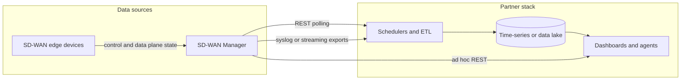

# Overview — Cisco Catalyst SD-WAN Manager and monitoring integrations

**Release focus:** 20.18 ([DevNet](https://developer.cisco.com/docs/sdwan/)). This overview is educational reference material only; see [DISCLAIMER.md](../DISCLAIMER.md).

## What Cisco Catalyst SD-WAN Manager is

Cisco Catalyst SD-WAN Manager (successor branding to *vManage* in many contexts) is the **control and visibility plane** for the SD-WAN overlay. It centralizes:

- Device lifecycle and inventory
- Configuration and policy (including configuration groups where used)
- Monitoring, alarms, and troubleshooting workflows
- RBAC, auditing, and northbound REST APIs

Your dashboards typically **poll the Manager’s REST API** (`/dataservice/...`) or consume **events/logs** exported from the platform into a SIEM or time-series database.

## Manager-sourced vs device-sourced data

| Kind | Typical access | Notes |
|------|----------------|-------|
| Inventory and reachability | Manager REST | Aggregated from devices; subject to last sync time |
| Real-time or near-real-time stats | Manager REST (statistics families) | Sampling intervals and retention are platform-defined |
| Long history (for example 30 days of location or signal) | **Your** store | Manager is not a general-purpose long-retention metrics database; see [location-history-retention.md](recipes/location-history-retention.md) |

## Polling patterns

1. **Bootstrap:** authenticate, then fetch device or site lists (paginate if offered).
2. **Correlate:** join on stable keys such as `uuid`, `deviceId`, or `system-ip` (field names vary by endpoint — validate in your lab).
3. **Detail:** request per-device or filtered statistics in bounded concurrency.
4. **Cache:** treat inventory and topology as slower-changing than tunnel or interface counters; use TTLs to reduce load.

## OT “simple workflows” vs full IT visibility

- **OT-focused:** prioritize inventory, alarms, cellular/WAN health, and a small set of maps. See [ot-minimal-pack.md](recipes/ot-minimal-pack.md).
- **IT / multi-cluster:** add federation, consistent `cluster_id` tagging, and centralized retention — see [02-rate-limits-scale.md](02-rate-limits-scale.md).

## Related reading

- [Authentication](01-auth-and-sessions.md)
- [Scale and multi-cluster](02-rate-limits-scale.md)
- [API index (DevNet links)](reference/api-index.md)
