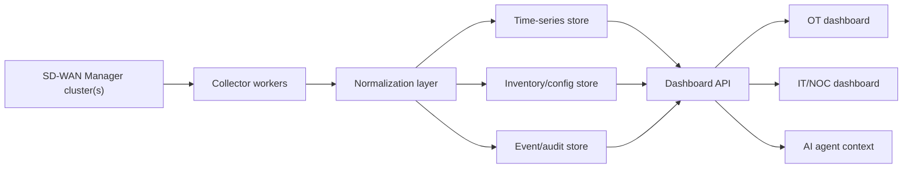

# Dashboard Architecture

## Goals

The dashboard should reduce operational effort by translating SD-WAN Manager API data into workflows:

- Which sites need attention now?
- Which devices are unreachable, degraded, or out of sync?
- Which transports or tunnels are failing?
- Which cellular circuits are weak before failover is needed?
- Which alarms, audit events, or RBAC changes require review?

## Reference Architecture

## Collection Layers

| Layer | Frequency | Examples |
| --- | --- | --- |
| Inventory baseline | 15-60 minutes | Device list, model, serial, site, coordinates, config status, config group. |
| Health snapshot | 1-5 minutes | CPU, memory, reachability, control connections, BFD sessions, OMP peers. |
| Transport metrics | 1-5 minutes | Tunnel state, latency, loss, jitter, interface throughput. |
| Cellular metrics | 1-5 minutes for cellular sites | Modem/SIM status, radio status, RSRP, RSRQ, RSSI, SINR/SNR. |
| Events and audit | 1-5 minutes | Alarms, events, audit logs, RBAC changes. |

## Multi-Cluster Model

For environments scaling beyond 20,000 devices, treat each SD-WAN Manager cluster as an independent source and aggregate normalized records centrally.

Required normalized keys:

- `cluster_id`
- `device_id`
- `system_ip`
- `site_id`
- `hostname`
- `timestamp`

Recommended derived keys:

- `site_key`: stable business identifier mapped from `site-id`.
- `transport_key`: local color plus remote color plus peer system IP.
- `interface_key`: device plus interface name plus VPN ID.

## OT View

OT users usually need fewer controls and stronger workflow guidance:

- Site status: normal, degraded, offline.
- Primary and backup transport status.
- Cellular signal and SIM/modem status.
- Active critical alarms.
- Last known location and movement history when relevant.

Hide low-level configuration unless the OT workflow requires it.

## AI Agent Context

For AI-assisted operations, expose Markdown recipes plus machine-readable JSON schemas or examples. Agents should know:

- Which endpoint to call.
- Required RBAC permissions.
- Expected identifiers.
- How to join records.
- What thresholds are customer-specific.
- Which actions are read-only and which mutate SD-WAN Manager.

