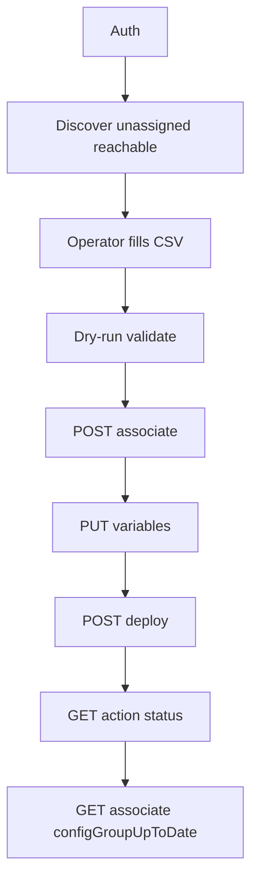

# UX 2.0 config groups — CSV onboard, associate, deploy, verify

## Scope

This recipe extends [config-group-ux2-sync-deploy.md](config-group-ux2-sync-deploy.md) with an **onboarding workflow**:

1. Authenticate (JWT login or Bearer API key from environment).
2. Discover **reachable** devices **not yet assigned** to any UX 2.0 configuration group.
3. Associate devices to a named configuration group and set **device variables** from a **CSV** file.
4. **Deploy** the configuration group and **poll** the asynchronous task.
5. Verify deployment success and **Custom Application** installation (app-hosting parcel triggered by config-group deploy).

**UX 2.0 only** (`sdwan` and `sd-routing`). Classic device templates are out of scope.

### Primary use case: SD-Routing

This workflow is written for **SD-Routing configuration groups** (`solution: sd-routing`). The sample script defaults to ``--solution sd-routing`` so list/associate/variables/deploy calls target SD-Routing groups only. Use ``--solution sdwan`` for SD-WAN-only labs, or ``--solution all`` when you intentionally manage both.

Important behaviors for SD-Routing:

| Topic | Behavior |
|-------|----------|
| Default CLI filter | ``--solution sd-routing`` (omit the flag in normal SD-Routing runs) |
| Variables PUT body | ``"solution": "sd-routing"`` taken from the resolved config group (never assumed SD-WAN) |
| Group name resolution | Exact name match within SD-Routing groups when default filter is active |
| Mismatch guard | Fails if CSV ``config_group`` resolves to a group whose ``solution`` differs from ``--solution`` |
| Discover output | Includes optional ``solution_hint`` per device when inventory exposes it |
| CLI config groups | SD-Routing supports CLI configuration groups when feature parcels are unavailable — same associate/variables/deploy APIs |

Validate field names and inventory ``solution`` hints against your Manager lab ([DevNet OpenAPI](https://developer.cisco.com/docs/sdwan/)).

## Outcome

Operators can generate a CSV template from live inventory, fill device-specific values, and run a guarded automation that associates, provisions, deploys, and verifies — without mirroring every Manager UI click.

## Prerequisites

- Cisco Catalyst SD-WAN Manager **20.18.x** with UX 2.0 configuration groups.
- Devices **detached from classic device templates** before association ([DevNet Feature Use Cases](https://developer.cisco.com/docs/sdwan/feature-use-cases/)).
- Target configuration group includes required profiles; for **Custom Application / app-hosting**, the group should contain the relevant service/other profile (first deploy triggers app install per [Cisco integration guide](https://www.cisco.com/c/en/us/td/docs/routers/sdwan/configuration/integrations/cisco-catalyst-sd-wan-integrations/third-party-app.html)).
- Python **3.10+**, venv, `pip install -e .` under `samples/` (see [START-HERE](../START-HERE.md#5-minute-lab-try)).

### Authentication

| Method | Environment |
|--------|-------------|
| Username/password JWT | `SDWAN_USERNAME`, `SDWAN_PASSWORD`, `SDWAN_AUTH_MODE=jwt` |
| Bearer “API key” | `SDWAN_JWT_TOKEN` (+ `SDWAN_JWT_CSRF` when required) |

See [01-auth-and-sessions.md](../01-auth-and-sessions.md). Never commit `.env` or tokens.

### RBAC (minimum)

| Operation | DevNet role (examples) |
|-----------|------------------------|
| List groups, associations, variables, schema | `Config Group-read`, `Config Group > Device-read` |
| Associate devices | `Config Group > Device-write` |
| Set variables | `Config Group-write` |
| Deploy | `Config Group > Device > Deploy-write` |
| Task status | Validate `x-roles-required` on `GET /device/action/status/{processId}` in your lab OpenAPI |

Multi-tenant provider: activate `VSessionId` before config-group calls ([multitenant-clusters.md](../multitenant-clusters.md)).

## API reference

| Step | Method | Path | DevNet |
|------|--------|------|--------|
| Login | POST | `/jwt/login` | [Authentication](https://developer.cisco.com/docs/sdwan/authentication/) |
| Inventory | GET | `/dataservice/device` | [Device](https://developer.cisco.com/docs/sdwan/device/) |
| Template attach probe | GET | `/dataservice/template/device/config/attached` | Legacy; warn if device still template-attached |
| List groups | GET | `/dataservice/v1/config-group?solution=sd-routing` | [Get Config Group By Solution](https://developer.cisco.com/docs/sdwan/get-config-group-by-solution/) |
| Group detail | GET | `/dataservice/v1/config-group/{configGroupId}` | [Get Config Group](https://developer.cisco.com/docs/sdwan/get-config-group/) |
| List associated | GET | `/dataservice/v1/config-group/{configGroupId}/device/associate` | [Get Config Group Association](https://developer.cisco.com/docs/sdwan/get-config-group-association/) |
| **Associate** | POST | `/dataservice/v1/config-group/{configGroupId}/device/associate` | [Create Config Group Association](https://developer.cisco.com/docs/sdwan/create-config-group-association/) |
| Get variables | GET | `/dataservice/v1/config-group/{configGroupId}/device/variables` | [Get Config Group Device Variables](https://developer.cisco.com/docs/sdwan/get-config-group-device-variables/) |
| Variable schema | GET | `/dataservice/v1/config-group/{configGroupId}/device/variables/schema?all=true` | [Get Config Group Device Variables Schema](https://developer.cisco.com/docs/sdwan/get-config-group-device-variables-schema/) |
| **Set variables** | PUT | `/dataservice/v1/config-group/{configGroupId}/device/variables` | [Create Config Group Device Variables](https://developer.cisco.com/docs/sdwan/create-config-group-device-variables/) |
| **Deploy** | POST | `/dataservice/v1/config-group/{configGroupId}/device/deploy` | [Deploy Config Group](https://developer.cisco.com/docs/sdwan/deploy-config-group/) |
| Task poll | GET | `/dataservice/device/action/status/{parentTaskId}` | [Device Template](https://developer.cisco.com/docs/sdwan/device-template/) (task status pattern) |

Associate request body (illustrative):

```json
{
  "devices": [
    { "id": "C8K-bee4a662-2a65-4b45-872a-b501bc5a465d" }
  ]
}
```

Variables PUT body (illustrative — **SD-Routing**):

```json
{
  "solution": "sd-routing",
  "devices": [
    {
      "device-id": "C8K-bee4a662-2a65-4b45-872a-b501bc5a465d",
      "variables": [
        { "name": "system_ip", "value": "10.20.1.10" },
        { "name": "site_id", "value": 201 }
      ]
    }
  ]
}
```

For SD-WAN groups, the same endpoint applies with ``"solution": "sdwan"``.

Deploy returns `parentTaskId`; poll until task completes, then re-read association for `configGroupUpToDate`.

## Discover unassigned reachable devices

There is **no** single “unassigned” inventory field. The sample builds the set of device IDs associated to **SD-Routing** config groups (default), then returns reachable inventory rows **not** in that set.

```bash
cd samples
python scripts/config_group_onboard.py --discover-unassigned --output output/unassigned.json
```

``--solution sd-routing`` is the default and may be omitted. Emit a CSV template from an SD-Routing group schema:

```bash
python scripts/config_group_onboard.py \
  --discover-unassigned \
  --template-group CG_SD_Routing_Lab \
  --output-csv output/onboard_template.csv \
  --output output/unassigned.json
```

## CSV format

Required columns:

| Column | Description |
|--------|-------------|
| `serial_number` | Matches `board-serial` / chassis in `GET /device` |
| `config_group` | Exact **SD-Routing** configuration group **name** (resolved to UUID; must match ``--solution``) |

Additional columns are **device variable names** for that group (e.g. `system_ip`, `site_id`, `host_name`). Header names must match variable `name` values from the schema GET.

Example (synthetic): [samples/examples/config_group_onboard.example.csv](../../samples/examples/config_group_onboard.example.csv)

## Orchestration



### Operator confirmation (required for writes)

| Action | Flags |
|--------|-------|
| Associate + variables | `--apply --confirm-apply` |
| Deploy + task poll | `--deploy --confirm-deploy` (requires `--apply`) |

Default without these flags: **read-only** (discover or `--dry-run`).

```bash
# Validate CSV only
python scripts/config_group_onboard.py --csv output/onboard_template.csv --dry-run

# Lab write + deploy (explicit confirmation)
python scripts/config_group_onboard.py \
  --csv output/onboard_template.csv \
  --apply --confirm-apply \
  --deploy --confirm-deploy \
  --output output/onboard_result.json
```

Optional: `--skip-locked`, `--poll-timeout 900`, `--poll-interval 15`, `--tenant emmanuel`, `--solution sd-routing` (default).

For SD-WAN-only onboarding, pass `--solution sdwan` explicitly.

## Verification

After deploy:

1. Poll `GET /dataservice/device/action/status/{parentTaskId}` until finished or timeout.
2. `GET .../device/associate` — expect `configGroupUpToDate` true and success-oriented `configStatusMessage`.
3. For Custom Application parcels, success is reported in the deploy task / device logs in Manager UI; the script flags groups without an app-hosting profile **hint** (heuristic on profile names/types — validate in lab).

## Edge cases

- **403 / 404:** RBAC or UX 2.0 not enabled; record HTTP status per call.
- **Still on classic template:** device may not appear in associate workflow; discovery sets `template_attached_warning` when serial appears in template attach list.
- **`device-lock: Yes`:** use `--skip-locked` or handle manually.
- **Wrong solution on group:** CSV references an SD-WAN group while default filter is SD-Routing — script fails with solution mismatch; align ``config_group`` name and ``--solution``.
- **Field drift:** trust DevNet OpenAPI and live responses over this document.
- **Multi-tenant:** list/associate/deploy in tenant context with `VSessionId`.

Source: [samples/scripts/config_group_onboard.py](../../samples/scripts/config_group_onboard.py)

Shared library: `sdwan_recipes.config_group`, `sdwan_recipes.device_actions`.

**Inline code documentation:** module and function docstrings in [samples/scripts/config_group_onboard.py](../../samples/scripts/config_group_onboard.py), [config_group.py](../../samples/src/sdwan_recipes/config_group.py), and [device_actions.py](../../samples/src/sdwan_recipes/device_actions.py) — workflow, CLI, CSV contract, API mapping, JSON report shape, exit codes.

---

## In plain language

Answers: **Which reachable devices are not in a config group yet?** **How do I bulk-assign them with per-device settings from a spreadsheet?** **How do I deploy and confirm the push (including Custom Application) succeeded?** Read-only by default; writes need explicit confirmation flags.

## Where to go next

- [UX 2.0 drift and deploy](config-group-ux2-sync-deploy.md)
- [Security — RBAC and deploy gates](../security-rbac-secrets.md)
- [Multi-tenant connectivity](multitenant-connectivity.md)

## Technical details

- Inline docs in `config_group_onboard.py`, `sdwan_recipes/config_group.py`, `device_actions.py`
- [API selection — CSV onboard row](../api-selection-guide.md)
- [API index — DevNet links](../reference/api-index.md)
- [DevNet — Create Config Group Association](https://developer.cisco.com/docs/sdwan/create-config-group-association/)
- [DevNet — Create Config Group Device Variables](https://developer.cisco.com/docs/sdwan/create-config-group-device-variables/)
