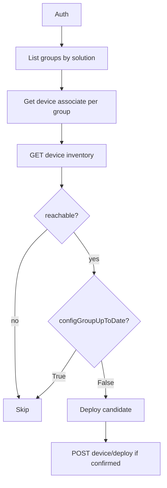

# UX 2.0 configuration groups — list, drift, deploy

## Scope

This recipe covers **UX 2.0 Configuration Groups** only (`/dataservice/v1/config-group*`) for **`sdwan`** and **`sd-routing`** solutions.

**Not supported here:**

- **UX 1.0 / classic device templates** (`/dataservice/template/*`, template attach, “Configure Devices” template push).
- Policy groups and topology groups (related UX 2.0 families; see DevNet **UX 2.0 Configuration** tag).

For legacy template attachment and mixed-mode probes, use [inventory-status-config-groups.md](inventory-status-config-groups.md) and [samples/scripts/inventory_status.py](../../samples/scripts/inventory_status.py). Hybrid migrations should follow Cisco configuration-group documentation, not template-push automation from this repo.

## Outcome

On a single Manager cluster:

1. List all UX 2.0 configuration groups for **SD-WAN** and **SD-Routing**.
2. List devices assigned to each group.
3. Optionally restrict to **reachable** devices (`GET /dataservice/device`).
4. Identify devices that are **out of sync** with the group (configuration push required).
5. **Deploy** the configuration group to selected devices (write API; operator confirmation required in samples).

## Prerequisites

- Cisco Catalyst SD-WAN Manager **20.18.x** with UX 2.0 configuration groups enabled.
- Devices managed by configuration groups are typically **detached from classic device templates** (Manager UI workflow).
- API user RBAC (DevNet `x-roles-required` names; validate in your tenant):
  - **Read:** `Config Group-read`, `Config Group > Device-read`
  - **Deploy:** `Config Group > Device > Deploy-write`
- Multi-tenant provider automation: establish `VSessionId` when required ([multitenant-clusters.md](../multitenant-clusters.md)). DevNet notes deploy may be **provider-view only** on some multitenant systems.

### Multi-tenant (provider acting as tenant)

On a **provider** cluster, `GET /v1/config-group` at the root provider context often returns **403** even when `GET /dataservice/tenant` succeeds. List configuration groups **in tenant context**:

1. `GET /dataservice/tenant` — find the row (`name`, `subDomain`, `tenantId`). Example: `name` **emmanuel**, `subDomain` **emmanuel.cisco12345.com**.
2. `POST /dataservice/tenant/{tenantId}/vsessionid` — returns `VSessionId`.
3. Send header **`VSessionId`** on subsequent `/dataservice/v1/config-group*` calls.

**Sample (read-only):**

```bash
python scripts/config_group_ux2.py --tenant emmanuel --output output/config_group_emmanuel.json
```

Or set `SDWAN_TENANT_NAME=emmanuel` in `samples/.env` (provider JWT or session). For **session** provider login, you can instead use `SDWAN_AUTH_MODE=session` and `SDWAN_TENANT_SUBDOMAIN=emmanuel.cisco12345.com` (see [multitenant-clusters.md](../multitenant-clusters.md)).

**Provider JWT:** After `vsessionid`, refresh XSRF with `GET /dataservice/client/token` using **Bearer + VSessionId**, then send **Bearer + VSessionId + X-XSRF-TOKEN** on `GET /v1/config-group*` (the sample client does this when `--tenant` or `SDWAN_TENANT_NAME` is set).

## 1. List all UX 2.0 configuration groups (SD-WAN + SD-Routing)

Use [Get Config Group By Solution](https://developer.cisco.com/docs/sdwan/get-config-group-by-solution/):

```http
GET /dataservice/v1/config-group?solution=sdwan
GET /dataservice/v1/config-group?solution=sd-routing
```

Each array element includes at least `id`, `name`, `solution`, `state`, `version`, and often `numberOfDevices` / `numberOfDevicesUpToDate`.

**Differentiate SD-WAN vs SD-Routing:** use the top-level `solution` field (`sdwan` | `sd-routing` per OpenAPI enum). Do not infer from group name alone.

Optional detail per group: [Get Config Group](https://developer.cisco.com/docs/sdwan/get-config-group/)

```http
GET /dataservice/v1/config-group/{configGroupId}?deviceList=true
```

## 2. List devices assigned to each group

Use [Get Config Group Association](https://developer.cisco.com/docs/sdwan/get-config-group-association/):

```http
GET /dataservice/v1/config-group/{configGroupId}/device/associate
```

Response shape (illustrative):

```json
{
  "devices": [
    {
      "id": "C8K-0f43906e-bd8f-443c-83f2-11eb85e45a51",
      "host-name": "vm5",
      "deviceIP": "172.16.255.15",
      "configStatusMessage": "",
      "configGroupUpToDate": "False",
      "device-lock": "No",
      "addedByRule": false
    }
  ]
}
```

Associate `id` values are the device identifiers used for deploy (see step 5).

## 3. Filter reachable devices only

Load overlay inventory:

```http
GET /dataservice/device
```

Join association rows to inventory on `uuid`, `system-ip`, `host-name`, or matching `id` / chassis fields (validate join keys in your lab).

Keep rows where `reachability` is `reachable` (same pattern as [collect_dashboard_snapshot.py](../../samples/scripts/collect_dashboard_snapshot.py)).

A device can be **reachable** and still **out of sync**.

## 4. Filter out-of-sync devices (push required)

For UX 2.0, prefer association field **`configGroupUpToDate`**:

| Value (examples) | Meaning |
|------------------|---------|
| `"True"` / `true` | Device matches current group configuration |
| `"False"` / `false` | **Out of sync** — deploy candidate |
| empty / missing | Treat as unknown; confirm in lab before automating |

Secondary signals:

- `configStatusMessage` on the association row (drift / error text).
- Group-level: `numberOfDevicesUpToDate < numberOfDevices` on the list/detail response.

Legacy `/dataservice/system/device/vedges` `configStatusMessage` is **not** the canonical source for this UX 2.0 workflow.

## 5. Deploy configuration to devices

Use [Deploy Config Group](https://developer.cisco.com/docs/sdwan/deploy-config-group/):

```http
POST /dataservice/v1/config-group/{configGroupId}/device/deploy
Content-Type: application/json

{
  "devices": [
    { "id": "C8K-0f43906e-bd8f-443c-83f2-11eb85e45a51" }
  ]
}
```

Success response includes `parentTaskId` for an asynchronous deploy task. Poll deploy job status endpoints from your Manager OpenAPI if you need completion tracking.

### Operator confirmation (best practice)

**Sample scripts in this repository must not call deploy unless the operator passes both `--deploy` and `--confirm-deploy`.** Default mode is read-only reporting only.

AI agents and automation should treat deploy as a **privileged, destructive** action: require explicit human approval per change window, even when documentation describes the API.

## Orchestration (recommended order)

1. Authenticate once ([01-auth-and-sessions.md](../01-auth-and-sessions.md)).
2. `GET /v1/config-group?solution=sdwan` and `sd-routing` (or one solution if scoped).
3. For each group (or a filtered `--group-id`): `GET .../device/associate`.
4. `GET /dataservice/device` → join reachability.
5. Filter `configGroupUpToDate` → out-of-sync set.
6. If deploying: `POST .../device/deploy` with device `id` list and confirmation flags.



## Edge cases

- **403 / 404:** RBAC or feature not enabled; record HTTP status per endpoint.
- **`device-lock: Yes`:** deploy may fail; exclude or handle manually.
- **`addedByRule: true`:** membership from rules; drift may differ from manual associates.
- **Rate limits:** batch groups; avoid per-device list storms ([02-rate-limits-scale.md](../02-rate-limits-scale.md)).
- **Field drift across patches:** trust DevNet OpenAPI and live responses over this document.

## Sample

Read-only report (default):

```bash
cd samples
python scripts/config_group_ux2.py --out-of-sync-only --reachable-only --output output/config_group_report.json
```

Deploy (lab only; requires write RBAC):

```bash
python scripts/config_group_ux2.py --group-id <uuid> --deploy --confirm-deploy
```

Source: [samples/scripts/config_group_ux2.py](../../samples/scripts/config_group_ux2.py)

---

## In plain language

Answers: **Which UX 2.0 config groups exist?** **Which devices belong to each group?** **Who is out of sync and needs a push?** Covers list and drift by default; deploy only with explicit confirmation and write permissions.

## Where to go next

- [Legacy config sync probe](inventory-status-config-groups.md)
- [Multi-tenant connectivity](multitenant-connectivity.md)
- [Security — deploy RBAC](../security-rbac-secrets.md)

## Technical details

- [API selection — UX 2.0 config groups](../api-selection-guide.md)
- [DevNet — Get Config Group By Solution](https://developer.cisco.com/docs/sdwan/get-config-group-by-solution/)
- [DevNet — Deploy Config Group](https://developer.cisco.com/docs/sdwan/deploy-config-group/)
