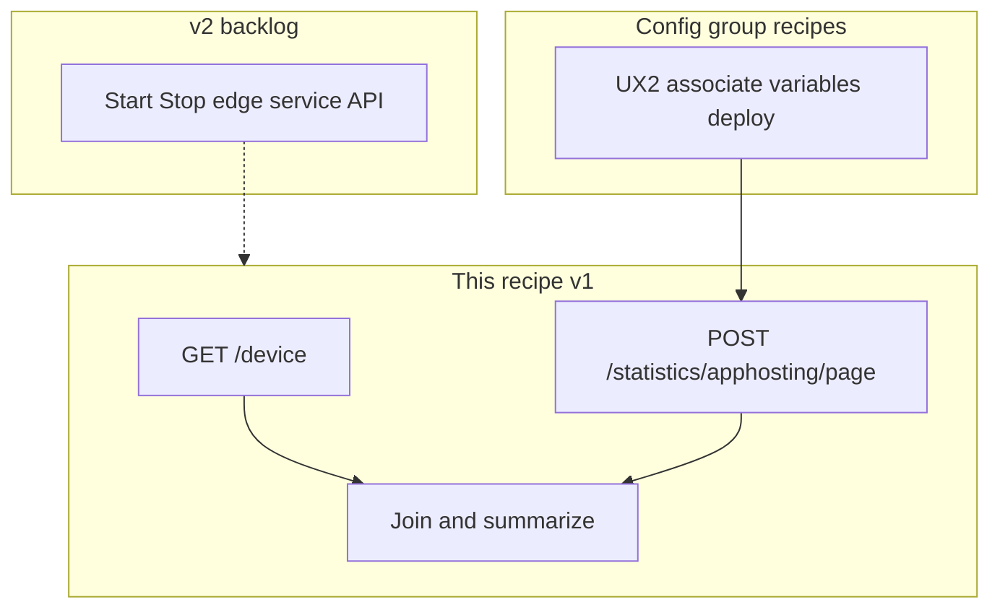

# Hosted Edge Services (IOx) — monitor app hosting on edges

## Outcome

Build **fleet and per-device views** of IOx container applications (Manager UI: **Monitor > Hosted Edge Services**): health, version, IOx state, CPU/RAM/disk usage, and associated devices — using **statistics-plane** APIs suitable for dashboards and collectors.

**Primary platform:** SD-Routing edges onboarded with UX 2.0 configuration groups. SD-WAN edges follow the same monitoring APIs when app-hosting is deployed.

**This recipe (v1) is read-only.** Provision/deploy is covered by [config-group-csv-onboard-deploy.md](config-group-csv-onboard-deploy.md). Start/stop edge service automation is **v2** (capture REST paths from lab `/apidocs`).

## Plain-language model

| Term | Meaning |
|------|---------|
| **Hosted Edge Services** | IOx apps running on IOS-XE edges; monitored at scale from Manager |
| **Custom Application / third-party app** | UX 2.0 **app-hosting** parcel in a config group; first deploy can install the app |
| **IOx** | Cisco container runtime on the device — not the same as SD-AVC “custom app” definitions |
| **`GET /sdavc/customapps`** | SD-AVC registry of user-defined applications — **related**, not the Hosted Edge Services monitor |



## Prerequisites

- Cisco Catalyst SD-WAN Manager **20.18.x** with Hosted Edge Services monitoring (20.18.1+ feature in release notes).
- **SD-Routing** devices (primary): onboarded via UX 2.0; config group includes app-hosting / Custom Application profile when deploying IOx apps.
- IOx-capable **IOS-XE** image on target devices; IOx activation per [Cisco integration guide](https://www.cisco.com/c/en/us/td/docs/routers/sdwan/configuration/integrations/cisco-catalyst-sd-wan-integrations/third-party-app.html).
- Python **3.10+**, `pip install -e .` under `samples/`.
- **Multi-tenant:** third-party custom applications are **tenant-scoped** on many deployments — activate `VSessionId` before queries ([multitenant-clusters.md](../multitenant-clusters.md)).

## Prescriptive recommendations

| Question | Recommendation |
|----------|----------------|
| Fleet IOx health over time? | **`POST /statistics/apphosting/page`** — statistics plane, bounded queries |
| Live break-glass on one device? | Manager UI **App Status Info** or device-scoped statistics query with `--device` |
| Deploy a new IOx app on SD-Routing? | **UX 2.0 config group deploy** — [config-group-csv-onboard-deploy.md](config-group-csv-onboard-deploy.md) with `--solution sd-routing` |
| Separate software install API? | `POST /device/action/install` exists for classic flows — **lab-validate** before preferring over config-group deploy |
| Long-term retention? | Export normalized rows to your TSDB — see [data-retention.md](../data-retention.md) |
| SD-AVC custom app list? | `GET /sdavc/customapps` — policy/template context, not Hosted Edge monitor |

## API catalog

Path prefix: **`/dataservice`**. Validate `x-roles-required` on your Manager **`/apidocs`** OpenAPI.

### Tier 1 — Monitoring (implement in sample)

| Step | Method | Path | Notes |
|------|--------|------|-------|
| Inventory join | GET | `/device` | Reachability, site-id, hostname |
| **App hosting stats** | POST | `/statistics/apphosting/page` | **Primary** fleet/history query (`query` + `size`; no `aggregation`) |
| Doc count (filtered) | POST | `/statistics/apphosting/doccount` | Same `query` body as `/page` — **sample default** |
| Doc count (unfiltered) | GET | `/statistics/apphosting/doccount` | Optional total when OpenAPI lists GET; library: `query_apphosting_doccount_get()` |
| Interface stats | POST | `/statistics/apphostinginterface/page` | Optional per-interface metrics |
| Interface doc count | POST | `/statistics/apphostinginterface/doccount` | Filtered; GET variant optional in library |
| Field discovery | GET | `/statistics/apphosting/query/fields` | May 404 if family disabled — try `/statistics/apphosting/fields` |

OpenAPI tag: **Monitoring - App Hosting** (confirmed in DevNet 20.15+ API change logs).

### Tier 2 — Provision and related (document only in v1)

| Workflow | APIs | Recipe |
|----------|------|--------|
| Deploy IOx via config group | `POST /v1/config-group/{id}/device/deploy`, etc. | [config-group-csv-onboard-deploy.md](config-group-csv-onboard-deploy.md) |
| Detect app-hosting profile | `GET /v1/config-group/{id}` | `group_has_app_hosting_hint()` in shared library |
| Deploy task poll | `GET /device/action/status/{processId}` | CSV onboard script |
| SD-AVC custom apps | `GET /sdavc/customapps` | [Get Custom App](https://developer.cisco.com/docs/sdwan/get-custom-app/) |
| Classic install | `GET/POST /device/action/install` | Lab-validate |

### Tier 3 — v2 (lab discovery only)

Manager UI **Start edge service** / **Stop edge service** (Monitor > Hosted Edge Services). Capture exact REST paths from a browser network trace and `/apidocs` search (`hosted`, `iox`, `edge service`). **Do not automate until confirmed** — track on [ROADMAP.md](../ROADMAP.md).

## Query patterns

### Illustrative `POST /statistics/apphosting/page` body

Shapes are **illustrative** — confirm with `GET …/apphosting/query/fields` and live OpenAPI:

```json
{
  "query": {
    "condition": "AND",
    "rules": [
      {
        "field": "entry_time",
        "type": "date",
        "operator": "last_n_hours",
        "value": ["24"]
      },
      {
        "field": "vdevice_name",
        "type": "string",
        "operator": "in",
        "value": ["10.20.1.10"]
      }
    ]
  },
  "size": 10000
}
```

The sample uses `vdevice_name` for device scoping (same convention as EIOLTE statistics). Override with `SDWAN_STATS_DEVICE_FIELD` or `--device-field` if your OpenAPI lists a different property.

### `aggregation` — not used on `/page`

App Hosting **`POST /statistics/apphosting/page`** uses the **alarms/events-style** body: `query` rules plus optional `size`. It does **not** use the **`aggregation`** object required by `POST /statistics/eiolte/uniqueAggregation` (see [cellular-signal-thresholds.md](cellular-signal-thresholds.md)). If you see `CLICKHOUSE0001` / *Missing tag : aggregation* on a **different** statistics family, check that family’s OpenAPI — do not copy the cellular aggregation block onto apphosting `/page` unless your lab capture proves it.

Filtered doccount uses **POST** with the **same `query` block** as `/page` (no separate GET query string). Optional unfiltered **GET** `/statistics/apphosting/doccount` may appear in OpenAPI for fleet totals without time/device filters.

### Common failures

| Symptom | Likely cause |
|---------|----------------|
| HTTP 403 | RBAC — need statistics read + device read; check OpenAPI roles |
| HTTP 404 | App Hosting statistics family not enabled on Manager |
| Empty `data[]` | No hosted apps deployed yet, or lookback window too narrow |
| Join misses inventory | Statistics device key differs from `GET /device` — validate join keys in lab |

## Join model

1. `POST /statistics/apphosting/page` → normalize rows from `data[]` or nested `items[]`.
2. `GET /device` → index by `system-ip`, `deviceId`, `host-name`, `uuid`.
3. Match statistics row fields such as `vdevice_name`, `system-ip`, `deviceId` (best-effort in sample).

## RBAC (minimum)

Discover exact role names on your patch via OpenAPI `x-roles-required`:

| Operation | Typical DevNet roles (examples) |
|-----------|----------------------------------|
| `POST /statistics/apphosting/page` | Statistics / monitoring read (confirm in `/apidocs`) |
| `POST /statistics/apphosting/doccount` | Same statistics read role as `/page` (filtered POST) |
| `GET /device` | Device Monitoring-read |
| `GET /sdavc/customapps` | Template Deploy-read, Policy Configuration-read (per DevNet) |

Use a least-privilege lab account; never commit credentials.

## Provisioning pointer (SD-Routing)

After deploy, return here to monitor. Bulk onboard:

```bash
cd samples
python scripts/config_group_onboard.py \
  --discover-unassigned \
  --template-group CG_SD_Routing_Lab \
  --output-csv output/onboard.csv
```

See [config-group-csv-onboard-deploy.md](config-group-csv-onboard-deploy.md) for `--apply --confirm-apply` and `--deploy --confirm-deploy`.

## Edge cases

- **403 in provider context:** run in tenant `VSessionId` for tenant-scoped custom apps.
- **No statistics yet:** deploy config group first; allow collection interval before alerting.
- **SD-AVC sync alarms:** see [syslog-alarms-audit-rbac.md](syslog-alarms-audit-rbac.md).
- **Field drift:** trust DevNet OpenAPI and live responses over this document.

## Lab validation appendix

No live Manager was available when authoring this recipe. Before production:

1. Open `https://<manager>:8443/apidocs` and search `apphosting`, `hosted`, `iox`.
2. Confirm `POST /statistics/apphosting/page` request schema (required fields, pagination).
3. Record redacted sample response; update join keys in `hosted_edge.py` if needed.
4. Capture Start/Stop edge service XHR paths for ROADMAP v2.
5. Run `python scripts/hosted_edge_services.py --discover-fields --output output/apphosting_fields.json`.

## Sample script

Source: [samples/scripts/hosted_edge_services.py](../../samples/scripts/hosted_edge_services.py)

Library: [samples/src/sdwan_recipes/hosted_edge.py](../../samples/src/sdwan_recipes/hosted_edge.py)

```bash
cd samples
# Fleet snapshot (last 24h)
python scripts/hosted_edge_services.py --hours 24 --output output/hosted_edge.json

# One device + field discovery
python scripts/hosted_edge_services.py --device 10.20.1.10 --hours 48
python scripts/hosted_edge_services.py --discover-fields

# Optional interface family + SD-AVC registry
python scripts/hosted_edge_services.py --include-interfaces --include-custom-apps --output output/hosted_edge_full.json
```

Report JSON includes `inventory.ok`, `apphosting_page.ok`, `rows[]` with optional `inventory` join (`inventory_join`: `ok` or `skipped`), `apphosting_doccount.count`, and `error` strings when APIs are unavailable (script exits 0 for read-only smoke).

---

## In plain language

Answers: **Which IOx apps are running on my edges?** **Are they healthy and how much CPU/RAM/disk do they use?** Use statistics App Hosting APIs for dashboards; use config-group recipes to deploy; use Manager UI for start/stop until v2 API paths are lab-confirmed.

## Where to go next

- [CSV config group onboard (SD-Routing)](config-group-csv-onboard-deploy.md)
- [UX 2.0 drift and deploy](config-group-ux2-sync-deploy.md)
- [Alarms and audit](syslog-alarms-audit-rbac.md)
- [Cisco Hosted Edge Services monitor guide](https://www.cisco.com/c/en/us/td/docs/routers/sdwan/configuration/Monitor-And-Maintain/monitor-maintain-book/m-hosted-edge-services.html)

## Technical details

- [API selection guide — Hosted Edge row](../api-selection-guide.md)
- [API index — App Hosting](../reference/api-index.md)
- [Hosted Edge Services SD-Routing guide](https://www.cisco.com/c/en/us/td/docs/routers/sd-routing/1718x/sd-routing-hosted-edge-services-1718x.html)
