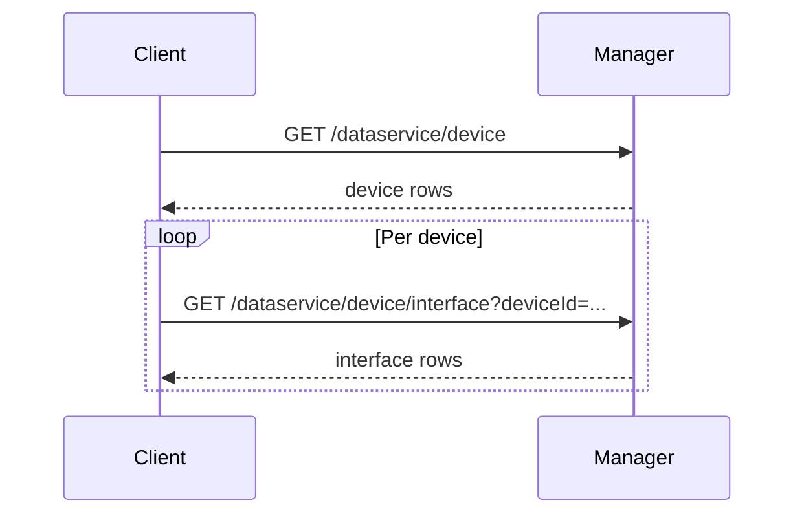

# Device inventory (interfaces, IP, cellular)

## Outcome

A dashboard or data pipeline answers: **which devices exist**, **which interfaces and addresses are present**, and optionally **which interfaces are cellular** for deeper radio metrics (see [cellular-signal-thresholds.md](cellular-signal-thresholds.md)).

## Data sources

- **Device list:** `GET /dataservice/device` — authoritative Manager inventory; fields such as `reachability`, `system-ip`, `host-name`, `site-id` are commonly present (validate in your lab).
- **Per-device interfaces:** `GET /dataservice/device/interface` with `deviceId` query parameter (value is typically the device **system-ip** or UUID-style id — confirm against OpenAPI for your patch release).

Official reference hub: [Cisco Catalyst SD-WAN Manager API 20.18](https://developer.cisco.com/docs/sdwan/).

## Orchestration

1. Authenticate (JWT recommended): see [../01-auth-and-sessions.md](../01-auth-and-sessions.md).
2. Fetch all devices; cache the list with a TTL (see [../02-rate-limits-scale.md](../02-rate-limits-scale.md)).
3. For each device (or a filtered subset), request interface inventory.
4. Normalize to your warehouse schema (device key + interface name + IPs).



## Field mapping (illustrative)

| Dashboard column | Typical JSON hints |
|------------------|--------------------|
| Device name | `host-name` |
| Device id | `uuid` / `deviceId` / `system-ip` |
| Site | `site-id` |
| Reachability | `reachability` |
| Interface | `ifname` or vendor-specific key |
| IPv4/IPv6 | address objects on interface row — **confirm in live responses** |

## Edge cases

- **RBAC:** monitoring-only users may receive empty subsets; never treat empty as “no devices in network” without checking HTTP status.
- **Offline devices:** interface payloads may be stale or empty; pair with reachability from the device list.
- **Pagination:** if your deployment paginates device lists, follow OpenAPI query parameters.

## Sample

Run from `samples/` after `pip install -e .`:

```bash
python scripts/inventory_devices.py --limit 5
```

Source: [samples/scripts/inventory_devices.py](../../samples/scripts/inventory_devices.py)
