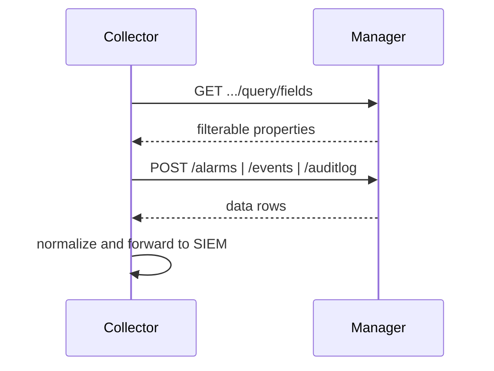

# Syslog, alarms, alerts, audit, and RBAC

## Outcome

Integrate **reactive monitoring** (alarms and events) and **governance** (audit logs, RBAC visibility) with NOC dashboards, SIEM, and ticketing — using DevNet-aligned POST queries and field discovery.

Official hub: [Alarm and Event — Cisco DevNet](https://developer.cisco.com/docs/sdwan/alarm-and-event/). **Trust DevNet and live `GET …/fields` responses** on your Manager patch over this document.

## Plain-language model

| Stream | What it answers | Typical audience |
|--------|-----------------|------------------|
| **Alarms** | What is wrong or was wrong? (active or cleared correlated problems) | NOC, paging |
| **Events** | What happened on the platform? (components, event names, severities) | Operations, troubleshooting |
| **Audit logs** | Who changed what on the Manager? (user, feature, message) | Security, compliance |
| **Syslog** | High-volume device/Manager logs forwarded to your SIEM | Security, long retention |
| **RBAC** | Which API identity can read which families; who has admin rights | Governance reviews |

**Alerts** in the Manager UI map to the **alarms** API family in DevNet. This recipe uses **read-only** query APIs for collectors. Mutating alarm admin actions (clear, mark viewed, disable) and user/role **write** APIs are out of scope for default automation — see [Out of scope](#out-of-scope-for-default-collectors).

## API catalog

Path prefix: **`/dataservice`**. Short paths below mean `/dataservice/...`.

### Alarms

| Operation | Method and path | DevNet / notes |
|-----------|-----------------|----------------|
| Query alarms | `POST /alarms` (recommended), `GET /alarms?query=` if query &lt; ~2048 chars | [Alarm and Event](https://developer.cisco.com/docs/sdwan/alarm-and-event/) |
| Field metadata | `GET /alarms/fields`, `GET /alarms/query/fields` | [Get Alarm Query Fields](https://developer.cisco.com/docs/sdwan/get-alarm-query-fields/) |
| Count matching query | `POST /alarms/count` | [Post Count](https://developer.cisco.com/docs/sdwan/post-count/) — query params `site-id`, `includeTenants` (provider) |
| Severity histogram / paging / aggregation | See OpenAPI “Monitoring - Alarms Details” on your release | Validate paths in lab |

### Events

| Operation | Method and path | DevNet / notes |
|-----------|-----------------|----------------|
| Query events | `POST /events`, `GET /events?query=` | [Alarm and Event — Event](https://developer.cisco.com/docs/sdwan/alarm-and-event/) |
| Field metadata | `GET /events/fields`, `GET /events/query/fields` | Discover filterable properties on your Manager |

### Audit logs

| Operation | Method and path | DevNet / notes |
|-----------|-----------------|----------------|
| Query audit | `POST /auditlog`, `GET /auditlog?query=` | [Alarm and Event — Audit Log](https://developer.cisco.com/docs/sdwan/alarm-and-event/) |
| Field metadata | `GET /auditlog/fields` | Discover `loguser`, `logfeature`, etc. |
| Severity summary | `GET /auditlog/severity/summary?query=` | Histogram with same query DSL |

### RBAC visibility (read-only)

| Operation | Method and path | Notes |
|-----------|-----------------|-------|
| List users | `GET /admin/user` | Requires admin-level RBAC; use dedicated governance account |
| User groups | `GET /admin/usergroup` | Custom roles and feature permissions |
| Current user role | `GET /admin/user/role` | Smoke test for automation identity |

DevNet: [User and Group](https://developer.cisco.com/docs/sdwan/user-and-group/).

### Legacy paths (avoid for new integrations)

Some older deployments expose `GET /event` or `GET /message/events`. **Prefer `POST /events`.** If `POST /events` returns **404**, the sample falls back to `GET /event` without query filters (`degraded` flag in output). Use `--probe-legacy` for explicit GET probes.

### Out of scope for default collectors

Do **not** automate without explicit operator confirmation and change control:

- Alarm clear, mark viewed, disable/enable alarm, correlation-engine admin
- `POST`/`PUT`/`DELETE` on `/admin/user`, user groups, or roles

## Query builder reference

Alarms, events, and audit logs share a **rules-based query** JSON body for POST (and for GET `query=` when URL length allows).

```json
{
  "query": {
    "condition": "AND",
    "rules": [
      {
        "field": "entry_time",
        "type": "date",
        "operator": "last_n_hours",
        "value": ["24"]
      }
    ]
  },
  "size": 10000
}
```

### GET vs POST

- **POST** — Recommended for complex filters and large result sets (DevNet: query &gt; ~2048 characters).
- **GET** — `GET /alarms?query=<url-encoded-json>` when the encoded query is short enough.

### Operators (validate on your Manager)

| Type | Operators (DevNet examples) | Example use |
|------|----------------------------|-------------|
| `date` | `last_n_hours`, `between` | Time window, custom UTC range |
| `string` | `in`, `equal` | Severity, system IP, user, feature |
| `boolean` | `equal` | Alarm `active` true/false |

Combine rules with `"condition": "AND"` or `"OR"`. Nested rule groups may be supported — confirm in OpenAPI for your patch.

### Filter dimensions cheat sheet

**Validate every field name via `GET …/fields` or `GET …/query/fields` on your Manager** before production queries.

| Filter by | Alarms (typical field) | Events (typical field) | Audit (typical field) |
|-----------|------------------------|------------------------|------------------------|
| Time | `entry_time` | `entry_time` | `entry_time` |
| Severity | `severity` (`Critical`, `Major`, …) | `severity_level` (`critical`, …) | `severity_level` |
| Device / system IP | `system_ip`, `vdevice_name` | discover via `/events/fields` | `logdeviceid` |
| Site | `site_id` (+ `site-id` query param on count API) | discover via fields | discover via fields |
| Alarm / event type | `rule_name_display` | component / event name fields | `logfeature`, `logmodule` |
| User / actor | — | — | `loguser`, `logusersrcip` |
| Active vs cleared | `active` (`true` / `false`) | — | — |
| Serial / chassis | Join from inventory (`board-serial`) if absent in payload | Same | Same |
| Multi-tenant (provider) | `includeTenants` on count; tenant in rows | validate fields | `tenant` in audit payload |

### Example queries

**Critical alarms — last 3 hours**

```json
{
  "query": {
    "condition": "AND",
    "rules": [
      { "field": "entry_time", "type": "date", "operator": "last_n_hours", "value": ["3"] },
      { "field": "severity", "type": "string", "operator": "in", "value": ["Critical"] }
    ]
  },
  "size": 10000
}
```

**Active alarms count — last 10 hours** (`POST /alarms/count`)

```json
{
  "query": {
    "condition": "AND",
    "rules": [
      { "field": "entry_time", "type": "date", "operator": "last_n_hours", "value": ["10"] },
      { "field": "active", "type": "boolean", "operator": "equal", "value": ["true"] }
    ]
  }
}
```

**Alarms for one system IP** ([Post Count example](https://developer.cisco.com/docs/sdwan/post-count/))

```json
{
  "query": {
    "condition": "AND",
    "rules": [
      { "field": "entry_time", "type": "date", "operator": "last_n_hours", "value": ["10"] },
      { "field": "system_ip", "type": "string", "operator": "in", "value": ["10.1.1.1"] }
    ]
  },
  "size": 100
}
```

**Critical events — last 3 hours**

```json
{
  "query": {
    "condition": "AND",
    "rules": [
      { "field": "entry_time", "type": "date", "operator": "last_n_hours", "value": ["3"] },
      { "field": "severity_level", "type": "string", "operator": "in", "value": ["critical"] }
    ]
  }
}
```

**Audit logs by user and time**

```json
{
  "query": {
    "condition": "AND",
    "rules": [
      { "field": "entry_time", "type": "date", "operator": "last_n_hours", "value": ["24"] },
      { "field": "loguser", "type": "string", "operator": "in", "value": ["api-reader-prod"] }
    ]
  },
  "size": 10000
}
```

**Audit logs for config / user governance** (feature filter — validate `logfeature` values in lab)

```json
{
  "query": {
    "condition": "AND",
    "rules": [
      { "field": "entry_time", "type": "date", "operator": "last_n_hours", "value": ["168"] },
      { "field": "logfeature", "type": "string", "operator": "in", "value": ["user", "config-group"] }
    ]
  },
  "size": 10000
}
```

Use this pattern to trace **configuration-group deploy** and RBAC changes; pair with [config-group-ux2-sync-deploy.md](config-group-ux2-sync-deploy.md).

## Field discovery workflow

1. Authenticate — JWT + `X-XSRF-TOKEN` for POST; tenant context if MSP ([multitenant-clusters.md](../multitenant-clusters.md)).
2. `GET /dataservice/alarms/query/fields`, `/events/fields`, `/auditlog/fields`.
3. Build rules only from returned `property`, `dataType`, and `options`.
4. `POST` query with `size`; use paging POST variants or smaller windows if results truncate.
5. Re-run discovery after Manager upgrades.

```bash
cd samples
python scripts/alarms_events.py --discover-fields --output output/governance_fields.json
```

## Orchestration for SIEM / dashboard

1. **Discover fields** weekly or on upgrade.
2. **Poll** alarms and events every 1–5 minutes; audit every 5–15 minutes (or longer).
3. **Normalize** to `cluster_id`, `system_ip`, `site_id`, severity, timestamp.
4. **Separate stores** — operational alarms vs administrative audit ([dashboard-architecture.md](../dashboard-architecture.md), [data-retention.md](../data-retention.md)).
5. **Map severities** to your SIEM taxonomy; do not log secrets in forwarded payloads.



## Syslog (push model)

For high-volume syslog, forward **device and Manager syslog** to your collector (UDP/TCP/TLS) rather than polling REST.

- Normalize with the same keys: `cluster_id`, `site_id`, `system_ip`, `device_id`.
- Correlate syslog with REST alarms by time, host, and event type.
- REST audit logs remain the authoritative source for **Manager administrative actions**.

## RBAC for collectors

Create dedicated service accounts (examples only):

- `api-reader-prod` — device/inventory/health read, **alarms read**, **events read**
- `audit-exporter-prod` — audit log read (may require broader admin read on some deployments)

DevNet documents role requirements such as **`Alarms-read`** for count APIs. Start read-only; expand only when HTTP **403** proves a gap. See [security-rbac-secrets.md](../security-rbac-secrets.md).

Use audit filters on `loguser` and `logfeature` to review:

- Failed or successful logins (where exposed)
- Role, group, user, template, policy, or config-group changes
- API token or RBAC configuration changes

Optional smoke: `GET /admin/user/role` with the automation account to confirm effective permissions.

## Sample script

Shared query helpers: [samples/src/sdwan_recipes/governance_query.py](../../samples/src/sdwan_recipes/governance_query.py).

**Discover fields**

```bash
python scripts/alarms_events.py --discover-fields --output output/governance_fields.json
```

**Default — last 24 hours, alarms + events + audit**

```bash
python scripts/alarms_events.py --hours 24 --output output/governance_query.json
```

**Filtered examples**

```bash
# Critical alarms, active only, last 6 hours
python scripts/alarms_events.py --resource alarms --hours 6 --severity Critical --active --include-count

# Audit for a user over 7 days
python scripts/alarms_events.py --resource audit --hours 168 --audit-user api-reader-prod

# Events for a component
python scripts/alarms_events.py --resource events --hours 12 --event-component vpn

# Legacy GET probes (lab only)
python scripts/alarms_events.py --probe-legacy --hours 1
```

Multi-endpoint snapshot (inventory + health + alarms + audit): [collect_dashboard_snapshot.py](../../samples/scripts/collect_dashboard_snapshot.py).

## Edge cases

- **403 on `GET …/fields`** — Field discovery may require higher RBAC than `POST /alarms` or `/auditlog`; POST queries can still succeed (validate in lab).
- **404 on `POST /events`** — Some patches expose `GET /event` only; sample falls back with a `degraded` flag.
- **Empty `data`** — May mean no matches, not “API broken”; check HTTP status and RBAC scope.
- **Severity casing** — Alarms often use `Critical`; events/audit may use lowercase `critical` in `severity_level`.
- **Serial number** — If not in alarm/event rows, join to inventory on `system_ip` / `uuid`.
- **Multi-tenant provider** — Activate tenant context before config-group or tenant-scoped audit reads.

---

## In plain language

Answers: **What is actively wrong?** **What happened on the platform?** **Who changed configuration or permissions?** Use field discovery first, then POST filters by time, severity, device, site, type, and user — without mirroring every Manager screen.

## Where to go next

- [Health and tunnels](health-cpu-mem-tunnels.md)
- [Security, RBAC, secrets](../security-rbac-secrets.md)
- [UX 2.0 config groups — deploy audit trail](config-group-ux2-sync-deploy.md)
- [Dashboard architecture](../dashboard-architecture.md)

## Technical details

- [API selection guide — governance rows](../api-selection-guide.md)
- [Authentication](../01-auth-and-sessions.md)
- [Cisco DevNet — Alarm and Event](https://developer.cisco.com/docs/sdwan/alarm-and-event/)
- [Cisco DevNet — Post Count](https://developer.cisco.com/docs/sdwan/post-count/)
